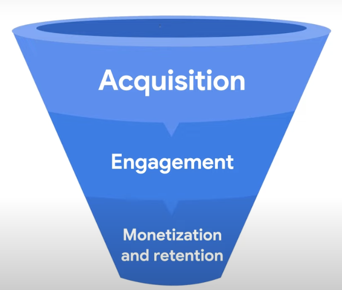

# Digital analytics

- **정의**
웹사이트나 앱에서 수집한 데이터를 측정 및 분석해 사용자의 행동을 이해하고 비즈니스/마케팅 의사결정에 활용하는 것

<i>Digital analytics is the process of collecting, measuring, and analyzing data from digital sources such as websites and mobile apps.</i>
	- to understand how users interact with their digital properties.
	- to improve our marketing and business decisions.

<i>It helps to know things like below.</i>
	- how users interact with website or app
	- how effective our marketing campaigns and content
	- how users find our website or app

- **목적**
고객 여정을 데이터로 파악해 비즈니스 목표 달성에 도움을 주는 것

# Marketing funnel (Customer journey)

- **획득**: 고객이 어떤 경로(광고, 검색, SNS 등)로 들어오는지 분석
- **참여**: 어떤 콘텐츠와 기능에 반응하고, 얼마나 머무르고, 공유하는지 확인
- **수익화 & 유지**: 실제 구매 전환율, 재방문율, 충성도 측정

- **Acquisition**: building awareness of your product or service and acquiring user interest. <u>where marketing channel brings users</u> to website or app.
- **Engagement**: when user interact with business. <u>what content users engage with and share with others.</u>
- **Monetization & Retention** : when user becomes customer and makes a purchase. <u>how many users become customers & how often they return to website or app.</u>

<mark>These insights can help better optimize the brand's performance and make informed decisions based on behavioral data.</mark>

# Goals & Usage by business

- 애견 훈련
	- 리드(잠재 고객 확보) 측정
- 스니커즈 판매
	- 수익성 높은 제품 위주 매출 확대
- 사진 편집 앱
	- 앱 사용 행태 분석 & 유료 전환율 증가
- 온라인 매거진
	- 인지도 확대 & 타겟 광고 정밀화

# Ecommerce

E-commerce sites use analytics <u>to gain insights into customer behavior on the website</u> to see
- how users find the service
- what products the users view and add to their shopping carts
- which products users actually purchase and the quantity of their buying

- 광고 캠페인 성과 비교 후 효과적인 채널에 집중
- 지역별 판매 데이터 분석 → 특정 지역 집중 마케팅
- 체크아웃 과정에서 이탈 구간 파악 후 개선

# In the end

- 디지털 애널리틱스는 **데이터 기반 의사결정**을 가능하게 한다
- 목표를 정하고 → 관련 지표를 정리하고 → 성공 기준을 정의해야 한다 
- GA(Google Analytics) 데모 계정을 활용해 실제 데이터 분석 연습 가능

[Google Demo](https://support.google.com/analytics/answer/6367342#access&zippy=%2C%EC%9D%B4-%EB%8F%84%EC%9B%80%EB%A7%90%EC%97%90%EC%84%9C%EB%8A%94-%EB%8B%A4%EC%9D%8C-%EB%82%B4%EC%9A%A9%EC%9D%84-%EB%8B%A4%EB%A3%B9%EB%8B%88%EB%8B%A4)