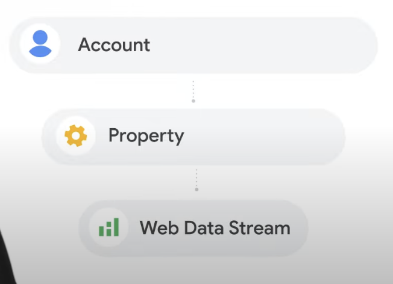
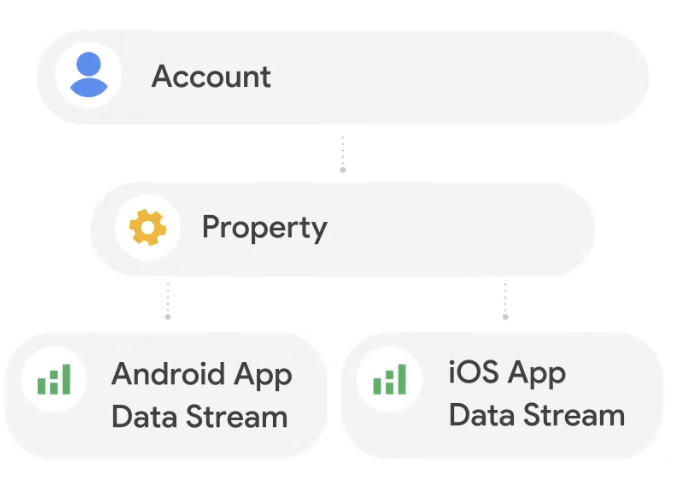
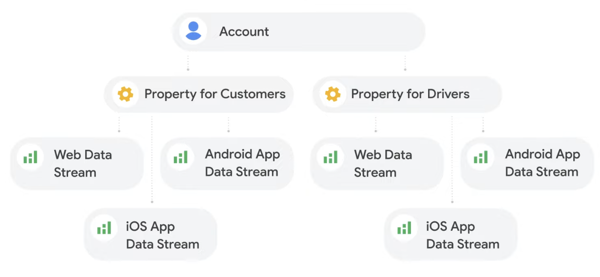

# Account

하나의 회사나 비즈니스 단위에서 소유하는 최상위 컨테이너

Account is **a collection of properties** whose data is owned by **a single business entity**

# Property

특정 웹사이트나 앱의 데이터를 처리하고 다른 Google 제품과 연결하는 분석 단위

Property represents **a grouping of user data**, like from a website or an app.

> the level where GA processes data and where we can create links with other products (Google Ads)

# Data Stream

웹·iOS·Android 등 개별 플랫폼에서 수집되는 사용자 데이터의 유입 통로

Data Stream is located underneath the each property and <u>represents the flow of data from a website or an app to the property.</u>

> the level where we can control things like what data gets collected.
> 	- page_view
> 	- scroll
> 	- outbound click
> 	- custom event
> 
> 수집되는 데이터(어떤 이벤트, 어떤 사용자 정보)가 결정되는 것은 **Data Stream 설정 화면**

- web data streams for website
- app data streams for mobile apps

<mark>Use a single web data stream to measure the web user journey to ensure consistent user and session reporting.</mark>

> - **하나의 web data stream**만 쓰는 것이 기본
> - 사이트가 여러 도메인으로 나뉘어져 있으면, **cross-domain measurement**를 써서 **끊기지 않는 유저 여정**으로 이어주는 것이 필요함

# Case Study

## fashion blog

## mobile game app

## food delivery service

# In the end

- One account per company
- One property per brand or business unit

|Level|Definition|Notes|
|---|---|---|
|**Account**|The top-level container that can include multiple properties.|A property can belong to only one account.|
|**Property**|Lives within an account; container for reports based on collected data.|Connects with Google products (e.g., Google Ads). One account → many properties.|
|**Data Stream**|Lives within a property; the source of data from an app or website.|One property → one or many data streams.|

